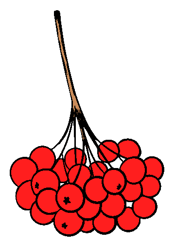

# BACCA: Benchmark Another Chain Code Algorithm

<p align="justify">
BACCA is an open source <i>C++</i> chain code benchmarking framework, developed from a modification of <a href="https://github.com/prittt/YACCLAB">YACCLAB</a>. BACCA provides <i>correctness</i> and average run-time (<i>average</i>) tests for chain code (alsoo known as boundary tracing) algorithms over a collection of real world datasets.

</p>

## Requirements

<p align="justify">To correctly install and run BACCA following packages, libraries and utilities are needed:</p>

- CMake 3.0.0 or higher (https://cmake.org),
- OpenCV 3.0 or higher (http://opencv.org),
- Gnuplot (http://www.gnuplot.info/),
- One of your favourite IDE/compiler: Visual Studio 2013 or higher, Xcode 5.0.1, gcc 4.7 or higher, .. (with C++11 support)

Notes for gnuplot:
- on Windows system: be sure of adding gnuplot to the system path to allow the automatic charts generation.
- on MacOS system: 'pdf terminal' seems to be not available, 'postscript' is used instead.

<a name="inst"></a>
## Installation

<p align="justify">Clone the GitHub repository (HTTPS clone URL: https://github.com/prittt/BACCA.git) or simply download the full master branch zip file and extract it (e.g BACCA folder).</p>
<p align="justify">Install software in BACCA/bin subfolder (suggested) or wherever you want using CMake. Note that CMake should automatically find the OpenCV path if correctly installed on your OS, download the BACCA Dataset (be sure to check the box if you want to download it or to select the correct path if the dataset is already on your file system, and create a C++ project for the selected IDE/compiler.</p>

<p align="justify">Set the <a href="#conf">configuration file (config.yaml)</a> placed in the installation folder (bin in this example) in order to select desired tests.</p>

<p align="justify">Open the project, compile and run it: the work is done!</p>

### CMake Configuration Variables

| Name                                 | Meaning                     | Default | 
| ------------------------------------ |-----------------------------| --------|
| `BACCA_DOWNLOAD_DATASET`           | whether to automatically download the BACCA dataset or not  | `OFF` |
| `BACCA_INPUT_DATASET_PATH`         | path to the `input` dataset folder, where to find test datasets  | `${CMAKE_INSTALL_PREFIX}/input` |
| `BACCA_OUTPUT_RESULTS_PATH`        | path to the `output` folder, where to save output results  | `${CMAKE_INSTALL_PREFIX}/output` |
| `OpenCV_DIR`                         | OpenCV installation path    |  -      |


<a name="conf"></a>
## Configuration File
<p align="justify">A <tt>YAML</tt> configuration file placed in the installation folder lets you to specify which kind of tests should be performed, on which datasets and on which algorithms. A complete description of all configuration parameters is reported below.</p>

- <i>perform</i> - dictionary which specifies the kind of tests to perform:
```yaml
perform:
  correctness:        false
  average:            true
  average_with_steps: false
```

- <i>correctness_tests</i> - dictionary indicating the kind of correctness tests to perform:
```yaml
correctness_tests:
  eight_connectivity_standard: true
  eight_connectivity_steps:    true
```

- <i>tests_number</i> - dictionary which sets the number of runs for each test available:
```yaml
tests_number:
  average:            10
  average_with_steps: 10
```

- <i>algorithms</i> - list of algorithms on which to apply the chosen tests, along with display name and reference for correctness check:
```yaml
algorithms:
  - Suzuki                          , Suzuki85(OpenCV)      ; Suzuki
  - Cederberg_LUT                   , Cederberg_LUT         ; Suzuki
  - Cederberg_LUT_PRED              , Cederberg_LUT_PRED    ; Suzuki
  - Cederberg_Tree                  , Cederberg_Tree        ; Suzuki
  - Cederberg_Spaghetti             , Cederberg_Spaghetti   ; Suzuki
  - Cederberg_Spaghetti_FREQ_All    , Cederberg_SpaghettiF  ; Suzuki
```

- <i>check_datasets</i>, <i>average_datasets</i>, <i>average_ws_datasets</i> - lists of datasets on which, respectively, correctness, average, and average_ws tests should be run:
```yaml
...
average_datasets: ["3dpes", "fingerprints", "hamlet", "medical", "mirflickr", "tobacco800", "xdocs"]
...
```

- <i>paths</i> - dictionary with both input (datasets) and output (results) paths. It is automatically filled by CMake during the creation of the project:
```yaml
paths: {input: "<datasets_path>", output: "<output_results_path>"}
```

- <i>write_n_labels</i> - whether to report the number of connected components in the output files:
```yaml
write_n_labels: false
```

- <i>color_labels</i> - whether to output a colored version of labeled images during tests:
```yaml
color_labels: {average: false, density: false}
```

- <i>save_middle_tests</i> - dictionary specifying, separately for every test, whether to save the output of single runs, or only a summary of the whole test:
```yaml
save_middle_tests: {average: false, average_with_steps: false, density: false, granularity: false}
```